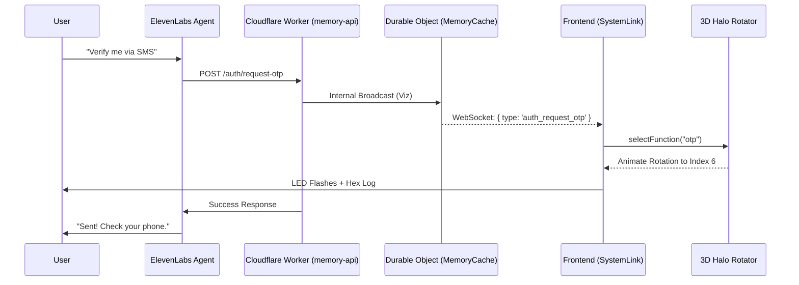

# Project Context & Instructions

## 1. Critical Technical Constraints
- **Content Preservation**: NEVER change content (text, copy, headings) given by the user unless explicitly requested. If you are refactoring code, you MUST preserve the original text exactly.
- **Tailwind CSS Only**: All styling MUST use Tailwind CSS classes. No custom CSS classes or external stylesheets. Custom CSS is reserved only for complex keyframe animations or third-party integrations (Lenis, SMIL).
- **Typography Standard**: Use Tailwind Typography (`prose` classes) for long-form content to ensure consistency.
- **WSL File Sync Bug**: The workspace environment (WSL) has a bug where standard file editing tools fail on large files.
  - **Mandatory Workaround**: You **MUST** use terminal commands (`cat`, `sed`, `rm`, `echo`) to read or write to `deploy/assets/js/scroll-flipper.js` or `deploy/assets/js/tab-flipper.js`.
  - **Reading**: `cat deploy/assets/js/filename.js`
  - **Writing**: `rm ...` then `cat << 'EOF' > ...`
- **Tool Priorities**:
  - **Searching**: Always prefer the `grep_search` tool over running `grep` manually in the terminal. The tool provides better structured output and is less prone to shell escaping errors.

## 2. Project Overview
- **Type**: Marketing website for Ampere AI (Multi-page architecture).
- **Source**: `deploy/index.html` is the source of truth for the homepage.
- **Stack**: TailwindCSS, Iconify icons, Vanilla JS (ES6 Modules), Supabase CDN.
- **Assets**: Scripts in `deploy/assets/js/`, Images from Supabase/Unsplash.

## 3. Deployment Workflow (Strict)
- **Source of Truth**: The `deploy/` folder is the only source for deployment.
- **CDN Usage**: Production HTML MUST use jsDelivr CDN links for all scripts.
- **Process**:
  1. Edit local files in `deploy/`. 
  2. **Do NOT** manually commit/tag.
  3. **EXECUTE**: `./scripts/publish.sh vX.Y.Z` (This performs tagging and pushing to origin).
  4. **VERIFY**: Check output.
- **Dual-Publish Rule**: If you touch both Frontend and Backend, you MUST run **BOTH** publish scripts. See section 3b.
- **Safe HTML Usage**: Use `python3 scripts/safe_replace_html.py` for complex grid/layout updates to prevent breakage.

## 3b. Backend Deployment Workflow (Memory API)
- **Scope**: All changes in `getampere-antigravity-backend/memory-api`.
- **Process**:
  1.  Edit files locally.
  2.  **EXECUTE**: `memory-api/scripts/publish.sh vX.Y.Z`
  3.  **VERIFY**: Check `wrangler tail` logs for successful deployment.
- **Strictness**: DO NOT use `wrangler deploy` manually. Use the script to ensure Backup, Type Gen, and Git Tags are synchronized.

## 3c. Variable Naming Standards (MANDATORY)
To avoid breaking frontend logic or ElevenLabs interpolations, always use these exactly:
- **Greeting**: Always use `user_time_greeting` (snake_case). Never `timeGreeting` or `userTimeGreeting`.
- **Session IDs**: Always use `session_id`.
- **Subject IDs**: Use `visitor_id` for web sessions.

## 4. Core Systems

### Modal System (v1.0.111+)
- **Usage**: `<section id="my-modal" data-amp-modal-content>`
- **Trigger**: `<button data-modal-trigger="my-modal">`
- **Features**: controlled by `modal.js`. Includes scroll locking (Lenis + Native), outside click close, and editor compatibility (Aura.build).

### ScrollSpy System (v1.585+)
- **Container**: `<nav data-scrollspy-nav>`
- **Behavior**: Tracks active sections (`data-scrollspy-section`) and moves a visual indicator (`data-scrollspy-indicator`).
- **Links**: `[data-spy-link]` auto-updates active class and handles smooth scrolling.
- **Reference**: `assets/js/global.js` (Class `ScrollSpy`).
- **Mobile Rule (CRITICAL)**: When implementing mobile "Horizontal Scroll" centering:
  - **NEVER** use `element.scrollIntoView()` inside a scroll handler. It triggers a page-wide scroll hijack if the container is off-screen, causing "Scroll Locking".
  - **ALWAYS** use scoped container scrolling: `navContainer.scrollTo({ left: calculatedOffset, behavior: 'smooth' })`.

### Anchor Scrolling (Lenis)
- **Usage**: `<a data-scrollto="#target">`
- **Behavior**: Global handler intercepts click, uses Lenis smooth scroll if available, falls back to native.

## 5. Animation Library (Reusable Patterns)

### Vertical Arrow (Pick up & Drop)
- **Pattern**:
  ```html
  <div class="group">
    <span class="hover-push-down-parent">
      <svg class="hover-push-down">...</svg>
    </span>
  </div>
  ```
- **Physics**: Linear lift, cast-down, drop-from-top sequence on hover.

### Section Reveal (Enter Animation)
- **Container**: `<section data-scroll-reveal-section>`
- **Content**: `<div data-reveal-group>` (Fades in + Translates Y).
- **Borders**: `<div data-grid-anim data-grid-axis="x">` (Expands).

### Animated Pulse Dot (Status Indicator)
- **Usage**: `<div class="w-2 h-2 rounded-full bg-blue-500 animate-pulse"></div>`
- **Context**: Use for live status, system operational badges, or active indicators (e.g., "Services", "All Systems Normal").
- **Colors**: `bg-green-500` (Operational), `bg-blue-500` (Active/Info), `bg-red-500` (Offline).

### Animated Status Pill Component (Standard Display)
- **Usage**: Used for live indicators or status badges on tech demos/visualizations.
- **Visual Style**: "Standard Pill" (Translucent, Flat, Static).
  - **Concept**: A passive information display, distinct from interactive buttons.
  - **Appearance**: Flat semi-transparent black body (`bg-black/40`) with a subtle white border (`border-white/10`).
- **Canonical Markup**:
  ```html
  <div class="absolute z-30 inline-flex items-center gap-3 px-4 py-2 rounded-full bg-black/40 border border-white/10 backdrop-blur-md shadow-2xl
              left-1/2 -translate-x-1/2 top-4 
              lg:left-auto lg:translate-x-0 lg:-translate-y-1/2 lg:right-20 lg:top-12">
      <!-- Status Dot: Pulses only in Standby -->
      <span class="w-1.5 h-1.5 rounded-full bg-blue-400 animate-pulse transition-all duration-300"></span>
      <!-- Status Text: Mono, Uppercase, 10px -->
      <span class="text-[10px] uppercase text-blue-300 tracking-widest font-mono transition-colors duration-300">Standby</span>
  </div>
  ```
- **Typography Standards**:
  - **Font**: `font-mono`.
  - **Size**: `text-[10px]` (Strict).
  - **Case**: `uppercase`.
  - **Tracking**: `tracking-widest`.
- **Placement Rules (Responsive)**:
  - **Mobile**: Center strictly (`left-1/2 -translate-x-1/2` top `4`).
  - **Desktop**: Align to the container frame but **bisect the border**.
    - **Vertical**: `top-[inset] -translate-y-1/2` (straddles the line).
    - **Horizontal**: `right-[inset + 2rem]` (visually inset, never flush).

### Apple-Like Glass Button (Interactive Control)
- **Usage**: Interactive toggle switches (e.g., Power Button). Distinct from display pills.
- **Visual Style**: "Rocker Switch Glass" (Muted Pebble, Physical Snap).
  - **Concept**: A physical button that feels like it "rocks" or "snaps" when pressed.
  - **Material**: High-opacity dark glass (`rgba(15, 15, 20, 0.7)`) with strong blur (`blur(20px)`).
- **Physics Implementation (CSS)**:
  - **Class**: `.apple-glass` (Base) + `.apple-glass-interactive` (Behavior).
  - **Glints (Rocker Effect)**: Vertical gradient on `::after` border.
    - **Top (12 o'clock)**: Hard/Bright (0.8 opacity) - Resting state light catch.
    - **Bottom (6 o'clock)**: Soft/Dim (0.2 opacity) - Resting state rim.
  - **Interaction (Snap)**:
    - **Hover/Active**: Forces a 180° rotation of the pseudo-element `::after`.
    - **Transition**: `none` (Instant). This creates a "Snap" effect where the Top/Bottom glints instantly swap places, simulating a rocker switch flipping.
- **Canonical Markup**:
  ```html
  <button class="w-[42px] h-[42px] rounded-full flex items-center justify-center 
                 apple-glass apple-glass-interactive 
                 text-slate-500 active:scale-95 transition-all">
      <svg class="w-4 h-4">...</svg> <!-- Icon -->
  </button>
  ```
- **State Handling (JS)**:
  - For persistent "On" states, add class `.apple-glass-rotated` to lock the glints in the inverted (180°) position.

### Breadcrumb Header (v2.160+)
- **Usage**: Header navigation indicator for deep-link/tech-demo pages.
- **Status**: Currently implemented as a static graphic (future: interactive component).
- **Canonical Markup**:
  ```html
  <div class="flex items-center gap-2 text-[10px] font-mono tracking-[0.2em] uppercase mb-6">
      <span class="text-blue-400">/</span>
      <span class="text-slate-500">Parent</span>
      <span class="text-blue-400">/</span>
      <span class="text-blue-400 font-semibold drop-shadow-[0_0_10px_rgba(96,165,250,0.4)]">Current</span>
  </div>
  ```
- **Rules**:
  - **Start**: Must begin with a leading `/`.
  - **Separators**: Always `text-blue-400`.
  - **Spacing**: Tightly packed (`gap*Future Component Requirements**:
  - **Semantics**: Must transition to `<nav aria-label="Breadcrumb">` with `<ol>`/`<li>` structure.
  - **Schema**: Must implement `BreadcrumbList` schema (LD-JSON or Microdata).
  - **Accessibility**: Active item requires `aria-current="page"`. Separators should be `aria-hidden="true"`.

## 6. Major Components

### Scroll Flipper (v1.565+)
**Description**: The primary 3D card stack interaction for "Use Cases".
**File**: `deploy/assets/js/scroll-flipper.js`
**Reconstruction Specs**:
- **Structure**: `[data-scroll-track-container]` > `[data-sticky-cards]` > Cards.
- **Logic**: Scroll-driven requestAnimationFrame loop. Calculates `delta` based on scroll position vs track top.
- **Responsive**: 
  - **Desktop**: Injects `!important` styles for 3D transforms (`rotateX`, `rotateY`, `translateY`).
  - **Mobile**: MUST clean up (removeProperty) all injected styles to let Tailwind utilities take over.

### Walkthrough / Feature ScrollSpy Component
**Usage**: Complex feature lists with a sticky table of contents (e.g., "Platform Walkthrough").
**Structure**:
1. **Container**: Grid layout (`grid-cols-12`).
2. **Left (Nav)**: Sticky Sidebar (`col-span-2`) with `[data-scrollspy-nav]`.
3. **Center (Content)**: Main content (`col-span-7`) with `[data-scrollspy-section]` blocks.
4. **Right (Metadata)**: Optional context column (`col-span-3`) with `[data-reveal-group]`.

**Agent Reconstruction Prompt**:
> "Rebuild the 'Walkthrough / ScrollSpy' component using the following specifications:
>
> 1. **HTML Structure**:
>    - **Container**: `<section id='section-id' class='relative w-full grid grid-cols-1 lg:grid-cols-12 gap-12 lg:gap-8'>`
>    - **Nav**: `<nav class='sticky top-48' data-scrollspy-nav>` inside Left Col.
>    - **Indicator**: `<div class='absolute left-[-1px] ...' data-scrollspy-indicator></div>`
> 
> 2. **Logic**:
>    - Initialize `ScrollSpy` on the nav.

### Icosahedron 3D Scene & AI Status System (v2.127+)
**Description**: The central interactive 3D hero element representing the AI core. Handles system state (Active/Standby/Off), physics simulation, and status visualization.
**File**: `deploy/assets/js/icosahedron-scene.js`
**Reconstruction Specs**:

1.  **System State Machine**:
    *   **States**: `ACTIVE` (Full simulation), `STANDBY` (Breathing mode, low power), `OFF` (Collapsed).
    *   **Auto-Standby**:
        *   **Timeout**: 120 seconds of idle time.
        *   **Warning**: Displays "STANDBY IN Xs" overlay at T-30 seconds.
        *   **Wake**: Any interaction (drag/scroll) immediately resets timer and restores `ACTIVE` state.

2.  **Physics Engine (Animation Loop)**:
    *   **Core Logic**: Uses Linear Interpolation (`lerp`) to transition `simIntensity`.
    *   **Critical Fix (v2.125)**: Standard lerp (`val += (target-val) * speed`) causes "stalling" at the end of the curve (80-99%).
    *   **Minimum Velocity Rule**: You MUST implement a "minStep" (e.g., `0.0025`) to ensure the transition completes efficiently.
        ```javascript
        let step = diff * lerpFactor;
        if (Math.abs(step) < 0.0025) step = (diff > 0) ? 0.0025 : -0.0025; // Force finish
        ```

3.  **UI Status Gauge ("AI ONLINE")**:
    *   **Visuals**: Dynamically generated 20-dot DOM array (`.ampere-dot`) + Status Text.
    *   **Logic**: Rendered in `animate()` loop based on `simIntensity` (0.0-1.0).
    *   **Behavior**:
        *   **Ramp Up**: Dots fill from 0-20, Text says "INITIALIZING XX%".

### Ampere AI Chat Interface (v2.600+)
**Description**: A modular voice/text chat interface integrating ElevenLabs SDK. Features a floating glass transcript window, mic error handling, and a unified status "Pill" that adapts to connection states (Text vs Audio Visualizer).
**File**: `deploy/assets/js/ai-chat.js`
**Dependencies**: `@elevenlabs/client` (via `esm.sh`).

**Agent Reconstruction Prompt**:
> "Create the `AmpereAIChat` class module with the following requirements:
>
> 1. **Dependencies**:
>    - Import `Conversation` from `https://esm.sh/@elevenlabs/client?bundle`.
>
> 2. **Architecture**:
>    - **Constructor**: `new AmpereAIChat(containerId, agentId, options)`.
>    - **Options**: `startBtnId`, `endBtnId`, `statusTargetId` (The Pill), `onStart/onEnd` callbacks.
>    - **State Machine**: Track `subStatus` (Connecting, Connected, Error).
>
> 3. **UI Component: Glass Transcript Window** (Rendered in `container`):
>    - **Style**: Fixed positioning or relative embed. `bg-slate-900/80 backdrop-blur-xl border border-white/10 rounded-2xl`.
>    - **Structure**:
>      - **Header**: Visualizer bars + Close Button.
>      - **Body**: `#ai-messages` (Scrollable flex col). System messages centered (slate-500), User right (blue bubble), Agent left (slate bubbles).
>      - **Footer**: Input field + Send button (Text Fallback).
>
> 4. **UI Component: Unified Status Pill** (Target: `statusTargetId`):
>    - **Logic**: The class MUST inject status updates into an external "Pill" container.
>    - **States**:
>      - **Connecting**: Text "Connecting..." (Yellow-400) + Dot (`animate-ping`).
>      - **Connected**: Text "Secure Connection" (Blue-400) + **Visualizer** (Voice UV).
>      - **Location Safety**: The Visualizer detects its container. If not found in `#voice-visualizer-container`, it automatically moves and re-initializes itself there to prevent layout shifts.
>      - **Error**: Text "Error" (Red-500).
>    - **Visualizer (Voice UV)**:
>      - Create 5 vertical bars (`div.uv-bar`).
>      - **Idle**: `animate-pulse` (Breathing).
>      - **Speaking**: `setInterval` loop modifying height (20%-100%) for organic waveform effect.
>
> 5. **Critical Logic & Safety**:
>    - **Mic Permission**: MUST call `navigator.mediaDevices.getUserMedia` *before* `Conversation.startSession`.
>    - **Fallback**: If Mic throws `NotAllowedError`, unhide the Transcript Window and show a "Text Mode Only" system message.
>    - **Power Up Delay**: Wait ~1.8s after Mic success before connecting to allow UI start-up animations to finish."

        *   **Steady**: All dots lit, Text says "AI ONLINE".
        *   **Ramp Down**: Dots drain 20-0, Text says "POWER OFF XX%".
    *   **Mobile Layout Constraints (Critical)**:
        *   The standard `bottom: 75px` places the gauge *behind* the control buttons on mobile.
        *   **Rule**: On mobile (`max-width: 600px`), you MUST position the container at `bottom: 155px` to clear the UI track.
        *   **Desktop**: `bottom: 180px`.

4.  **Scene Components**:
    *   **Nodes**: 12 vertices of Icosahedron + recursive subdivisions (frequency 2 or 3).
    *   **Glow**: SpriteMaterial with additive blending.
    *   **Shell**: Dual rotating wireframe spheres (inner/outer) with gyroscopic counter-rotation.

5.  **Configuration (Data Attributes)**:
    *   **Usage**: Control physics and timing directly via HTML attributes on the container `div`.
    *   `data-standby-timeout` (Default: `120`): Seconds of idle time before entering Standby mode.
    *   `data-standby-warning` (Default: `30`): Seconds before timeout to show the "STANDBY IN X" warning.
    *   `data-auto-recenter` (Default: `2.5`): Seconds after interaction ends before the camera smooths back to center.
    *   `data-lerp-speed` (Default: `0.015`): The interpolation factor for system state transitions. Higher = faster/snappier.
    *   `data-min-velocity` (Default: `0.0025`): The minimum step size for transitions to prevent "asymptotic stalling" (the feeling of losing steam at 99%).
    *   `data-rotation-rpm` (Default: `0.17`): The base rotation speed of the sphere in Revolutions Per Second.

    **Example**:
    ```html
    <div id="canvas-container"
         data-standby-timeout="120"
         data-standby-warning="30"
         data-auto-recenter="2.5"
         data-lerp-speed="0.015"
         data-min-velocity="0.0025"
         data-rotation-rpm="0.17"></div>
    ```
>    - Cache links and targets.
>    - On scroll, determine active target (top <= activeOffset).
>    - Move indicator (`translateY`) to match active link position.
> 
> 3. **Animation**:
>    - Wrap columns in `data-reveal-group` for staggered entry."

### Ampere 3D Key (RenderJS)
**Description**: High-fidelity 3D logo visualization using Three.js (internally referred to as RenderJS).
**File**: `deploy/assets/js/ampere-3d-key.js`
**Dependencies**: Three.js (v0.160.0+) via Import Map.
**Specs**:
- **Geometry**: Custom Extruded Shape (Rounded Square with bevels) to match the Ampere logo mark. Built programmatically via `THREE.Shape`.
- **Theme Support (v1.738+)**:
  - **Usage**: Add `data-key-theme="dark"` to the container element.
  - **Light Mode (Default)**: Glossy White Body (Ceramic), Navy Ink (`#1e2a40`).
  - **Dark Mode**: Matte Navy Body (`#1e2a40`), Navy Ink (`#1e2a40`). Unified solid look.
  - **Material Physics**:
    - *Light*: `Roughness: 0.2`, `Clearcoat: 1.0` (Glossy/Reflective).
    - *Dark*: `Roughness: 0.6`, `Clearcoat: 0.0` (Matte/Flat) - prevents "black mirror" effect in dark voids.
- **Texture**: Dynamic SVG-to-CanvasTexture generation.
  - **Ink Color**: Standardized to **#1e2a40** (Medium-Dark Navy) for both themes to ensure consistency.
  - **UV Mapping**: Asymmetric mapping to handle bevel distortion (-1.75 to 1.90 range).
- **Choreography (`setProgress(0-1)`)**:
  1. **Rotation**: Tilts up from flat face-down (-PI/2.1) to facing forward.
  2. **Lighting**:
     - *Ambient*: Dark (0.05) -> Bright (0.9).
     - *Rim*: Starts bright (backlit) -> Dims as object faces camera.
     - *Specular Sweep*: Point light physically moves across X axis (-6 to +8) to create a "shine" reflection across the face.
- **Idle Animation**: Continuous `requestAnimationFrame` loop adds:
  - Vertical bobbing (Sine wave).
  - Subtle rotational drift (Y/Z axis wobble) to feel "alive" while floating.
- **Usage**:
  ```javascript
  import { Ampere3DKey } from './assets/js/ampere-3d-key.js';
  const key = new Ampere3DKey(document.getElementById('canvas-container'));
  // Update on scroll
  key.updateProgress(scrollyProgress); // 0.0 to 1.0
  ```

### The "Glass Socket" Card (Component Definition v15.5)
**Official Name**: `Ampere-Glass-Socket-v15`
**Description**: A generative-UI component characterized by a frosted glass body, a unique Javascript-calculated "socket" cutout in the top-right corner, and a monotone glass button installation. It is NOT a static SVG; it is a computed path that responds to container resizing.

#### 1. Generative Architecture
This component **must** be generated via the `scripts/rebuild_tech_demo.py` pipeline.
- **Data Source**: Python list (`cards_data`) containing Title, Subtitle, Hex Colors, and Metric Rows.
- **Injection**: Python regex cleans raw SVGs to `text-white/90` and injects them into the template.
- **Path Engine**: A `ResizeObserver` in Javascript calculates the SVG `d` attribute in real-time.

#### 2. The Socket Geometry (Javascript Math)
The signature curve is defined by a 5-step path logic running in the client DOM.
**Constants**: `S = 0.5` (Scale Factor).
**Path Sequence**:
1.  **Start**: Top-Left (`0,0`) -> Top-Right Indent (`w - 95.36, 0`).
2.  **Curve 1 (Convex Shoulder)**: Standard Bezier.
    *   `cp1`: 33.11 * S, 0
    *   `cp2`: 59.94 * S, 26.84 * S
    *   `end`: 70.39 * S, 51.98 * S
3.  **Line 2 (Vertical Drop)**: `l 0 49.03 * S` (`l_short`).
4.  **Curve 3 (Concave Throat)**: **INVERTED** Bezier (V->H) causing the "socket" look.
    *   `cp1`: 0, 33.11 * S (Swapped X/Y from shoulder)
    *   `cp2`: 26.84 * S, 59.94 * S
    *   `end`: 51.98 * S, 70.39 * S
5.  **Line 4 (Horizontal Run)**: `l 49.03 * S 0` (`l_short`).
6.  **Curve 5 (Convex Lip)**: Standard Bezier (Return pattern).
    *   `cp1`: 33.11 * S, 0
    *   `cp2`: 59.94 * S, 26.84 * S
    *   `end`: 70.39 * S, 51.98 * S

#### 3. Visual Layer Stack (Z-Index Strategy)
Correct layering is critical for the "Glass" effect. Attempting to flatten these layers will break the optical illusion.

*   **Layer 0 (Base)**: `<svg>` with `.socket-path`.
    *   **Stroke**: `rgba(255,255,255,0.2)` (1px width).
    *   **Fill**: `linearGradient` (White 10% -> Transparent).
*   **Layer 1 (The Blur)**: `div` with `backdrop-blur-md` (Tailwind).
    *   **Clipping**: Manually clipped via CSS `polygon` to roughly match the socket shape (excludes the button area).
    *   `clip-path: polygon(0 0, calc(100% - 96px) 0, 100% 96px, 100% 100%, 0 100%)`.
*   **Layer 2 (The Button)**: `absolute top-0 right-0 w-14 h-14`.
    *   **Body**: `backdrop-blur-xl` + `bg-white/10`.
    *   **Physics**: `-webkit-mask-image: radial-gradient(white, black)` to force blur radius compliance on WebKit.
    *   **Ring**: SVG `<circle>` with `stroke-width="1.5"` and `stroke="url(#glass-border-grad)"`.
    *   **Icon**: Centered `text-white`.

### 3D Icosahedron Scene (v2.00+)

### Glass Control Cluster ("Power Pill")

#### 4. The Expansion Mode (v2.700+ "Zen Mode")
**Description**: The "Glass Socket" can expand from a card into a constrained overlay within the right column using a "DOM Reparenting" technique to escape stacking contexts.
**File**: `deploy/assets/js/card-expander.js`
**Features**:
- **DOM Escape**: Temporarily moves the card to `document.body` to break free from parent `transform-style: preserve-3d` constraints (which trap `position: fixed` elements).
- **Strict Coordinate Constraints**: 
  - Calculates the column's **Content Box** (removing padding/borders) using `getComputedStyle`.
  - Forces the card to these exact pixel coordinates to prevent bleeding into scrollbars or edges.
- **Top-Right Dynamic Action**:
  - **Collapsed**: Shows "Expand" icon (Arrows out).
  - **Expanded**: Swaps SVG to "Close" icon (X) path; forces `opacity: 1` and `pointer-events: auto` on the `.expand-trigger`.
- **Placeholder**: Injects a `div.socket-card-placeholder` to maintain document flow.

**Agent Reconstruction Prompt (Expansion Ability)**:
> "Implement the 'Zen Mode' expansion for value-prop cards:
>
> 1.  **Javascript Controller (`initCardExpander`)**:
>     -   **Init**: Listen for clicks on `.socket-card-container`.
>     -   **Expand Logic**:
>         1.  **Measure**: `startRect = card.getBoundingClientRect()`.
>         2.  **Placeholder**: Insert exact-size placeholder in original DOM spot.
>         3.  **Lift**: `document.body.appendChild(card)` and set `position: fixed`, `top/left/width/height` to `startRect` (!important).
>         4.  **Target**: Calculate `#tech-demo-right-column` metrics. Subtract padding (`parseFloat(style.paddingLeft)` etc.) to find the **Visual Content Box**.
>         5.  **Animate**: Transition to the Target coordinates.
>     -   **Button Logic**:
>         -   Select `.expand-trigger` inside the card.
>         -   Force `opacity: '1'`, `display: 'flex'`, `pointerEvents: 'auto'`.
>         -   Swap inner SVG path to a Close (X) icon.
>
> 2.  **Collapse Logic**:
>     -   Find placeholder.
>     -   Animate back to placeholder's rect.
>     -   **On Complete**: Move card back to original DOM position (replace placeholder). remove `!important` styles.
> "
**Description**: The "Apple Glass" style control interface for interacting with system states (Active/Standby/Off). Features a "Partial Border" aesthetic where borders fade in/out based on light angles, and deep hover physics.
**File**: `deploy/assets/js/tech-demo-scene.js` (Injected dynamically)
**Dependency**: Tailwind CSS (Build Process)

**Structure**:
1.  **Container (`#ampere-controls-cluster`)**: Flex column wrapper.
2.  **Track (`#ampere-ui-track`)**: The glass vessel.
    -   HEIGHT: `48px` (Desktop Standard).
    -   BG: Composite Linear Gradients (Padding-box Body + Border-box Rim).
    -   SHADOW: `0 8px 32px rgba(0,0,0,0.12)`.
    -   BACKDROP: `blur(24px)`.
3.  **Thumb (`#ampere-ui-thumb`)**: The active control pill.
    -   SIZE: `36px` Circle.
    -   INSET: `5px` (Top/Left). `48px (Track) - 36px (Thumb) - 2px (Border) / 2 = 5px`.
    -   STYLE: Emerald Green Gradient (Active) / Silver (Standby).
    -   GLOW: `box-shadow` + `inset` highlight.
4.  **Labels (`.ampere-ui-label`)**:
    -   TEXT: White (Active) for Max Contrast.
    -   FONT: `ui-sans-serif, system-ui` (Clean, Legible).

**Agent Reconstruction Prompt**:
> "Rebuild the 'Glass Control Cluster' using the following specifications:
>
> 1.  **CSS-in-JS Architecture**:
>     -   Inject a `<style>` block for `#ampere-ui-track` and `#ampere-ui-thumb`.
>     -   **The 'Glass' Recipe (MANDATORY)**:
>         ```css
>         background: 
>             linear-gradient(rgba(255, 255, 255, 0.1), rgba(255, 255, 255, 0.05)) padding-box,
>             linear-gradient(135deg, rgba(255, 255, 255, 0.45) 0%, transparent 40%, transparent 60%, rgba(255, 255, 255, 0.45) 100%) border-box;
>         border: 1px solid transparent;
>         ```
>     -   **Hover Physics**: 
>         -   Track Lift: `transform: translateY(-1px);`
>         -   Shadow Deepening: `box-shadow: 0 12px 48px rgba(0,0,0,0.3);`
>         -   Transition: `all 0.4s ease`.
>
> 2.  **Layout Logic**:
>     -   **Flex Layout**: `justify-content: space-between` for labels.
>     -   **Thumb Positioning**: Absolute `top: 5px`, `left: 5px`.
>     -   **State Machine**:
>         -   *STANDBY*: `left: 5px` (Index 0).
>         -   *ACTIVE*: `left: calc(50% - 18px)` (Index 1).
>         -   *OFF*: `left: calc(100% - 41px)` (Index 2).
>
> 3.  **Aesthetics (Emerald Active)**:
>     -   If State == ACTIVE:
>         -   Thumb BG: `linear-gradient(180deg, rgba(5, 150, 105, 0.9), rgba(4, 120, 87, 0.9))` (Emerald-700).
>         -   Text Color: `#FFFFFF`.
>         -   Text Shadow: `0 0 8px rgba(5, 150, 105, 0.6)`.
> "
**Description**: Interactive 3D network visualization with connecting nodes and electrons.
**Files**: `deploy/assets/js/icosahedron-scene.js` (Main), `deploy/assets/js/icosahedron-scene-blue-silver.js` (Variant).

**Reconstruction Specs**:

1.  **Dependencies**: Requires standard Three.js Import Map (`three` and `three/addons/`) in `<head>`.
2.  **Container Styling (Required)**:
    ```css
    .scene-container {
        width: 100%; height: 100%;
        background-color: #05060f; /* Seamless load */
        overflow: hidden;
    }
    .scene-container canvas {
        pointer-events: auto !important; /* Ensures OrbitControls receive events */
        touch-action: none; /* CRITICAL: Prevents browser scroll/swipe jacking */
    }
    ```
3.  **Initialization**:
    ```javascript
    import { IcosahedronScene } from './assets/js/icosahedron-scene.js';
    new IcosahedronScene(document.getElementById('target-container'));
    ```

**Browser Compatibility Constraints (CRITICAL)**:
Certain browsers (like "Comet" or specialized setups) report extremely high `deltaY` values for scroll events, which causes standard Three.js `OrbitControls` to instantly zoom the camera to infinity or zero, making the scene "disappear".

**Mandatory Implementation Pattern**:
You **MUST** use the "Discrete Step Zoom" pattern when implementing `OrbitControls`. Do NOT rely on native `enableZoom`.

```javascript
initControls() {
    this.controls = new OrbitControls(this.camera, this.renderer.domElement);
    this.controls.enableDamping = true;
    this.controls.dampingFactor = 0.05;
    
    // 1. DISABLE Native Zoom (Prevent infinite jumps)
    this.controls.enableZoom = false; 
    
    this.controls.rotateSpeed = 0.5;
    this.controls.autoRotate = false; 

    // 2. Custom "Discrete Step" Zoom Handler
    const handleZoom = (e) => {
        e.preventDefault();
        e.stopPropagation();

        if (e.deltaY === 0) return;

        // 3. HARD CLAMP LIMITS (Prevent vanishing)
        const minD = 1.2;
        const maxD = 60.0;
        const zoomFactor = 0.05; // Fixed 5% step regardless of scroll speed

        const dir = new THREE.Vector3().subVectors(this.camera.position, this.controls.target);
        const dist = dir.length();
        dir.normalize();

        let newDist = dist;
        // 4. IGNORE MAGNITUDE (Only check direction)
        if (e.deltaY > 0) {
            newDist = Math.min(dist * (1 + zoomFactor), maxD);
        } else {
            newDist = Math.max(dist * (1 - zoomFactor), minD);
        }

        this.camera.position.copy(this.controls.target).addScaledVector(dir, newDist);
    };
    
    // 5. ATTACH (Non-Passive to allow preventDefault)
    this.renderer.domElement.addEventListener('wheel', handleZoom, { passive: false });
}
```

**Agent Reconstruction Prompt**:
> "Rebuild the '3D Icosahedron Scene' (Manhattan Sphere) using these exact specifications:
>
> 1. **Geometry & Structure**:
>    - **Outer Cage**: `THREE.IcosahedronGeometry(radius: 1.5, detail: 2)`. 
>      - Rendered as `THREE.LineSegments` (Wireframe).
>      - Color: `#88b0d1`. **Opacity: 0.1 (10%)**.
>    - **Central Sphere**: `THREE.SphereGeometry(radius: 0.72, widthSegments: 64, heightSegments: 64)`.
>      - Material: `MeshPhysicalMaterial` (Obsidian Glass).
>      - Color: `#000000`, Roughness: 0.15, Clearcoat: 1.0.
>    - **Nodes**: Placed at unique vertices of the Outer Cage geometry.
>      - Geometry: `THREE.SphereGeometry(radius: 0.015, widthSegments: 8, heightSegments: 8)`.
>      - Attributes: Each node gets a random persistent HSL color.
>
> 2. **Circuitry Logic (Manhattan Algorithm)**:
>    - Generate 65+ 'Bus Lines' on the Central Sphere surface.
>    - **Routing**: Strictly orthogonal. Steps must only change Phi OR Theta, never both at once.
>    - **Visuals**: Use `LineGeometry` (Fat Lines) with `linewidth: 2.5`.
>      - Base Color: `#041725`.
>      - **Opacity Strategy**: 5% Inactive (Stealth) -> 100% Active.
>      - Active Flash: When an electron passes, the line lerps to Bright Blue (`r:0, g:0.6, b:1.0`).
>    - **Electrons**: 120 particles (`THREE.Sprite`) traversing the paths.
>      - Speed increases based on camera proximity (activity level).
>
> 3. **Animation & Interaction**:
>    - **Neural Activity (Node Flashing)**:
>      - **Trigger**: ~2% probability per tick (Slower, calmer rhythm).
>      - **Decay**: Slower fade-out (0.92 multiplier) for prolonged glow.
>      - **Proximity**: Nodes closer to screen center scale up (1.4x).
>    - **Controls**: MANDATORY 'Discrete Step Zoom' (see code block). Instantly clamps `deltaY` and steps 5%.
>
> 4. **Lighting Setup**:
>    - **Ambient**: `#aaccff` (Intensity 0.2).
>    - **Spotlight**: `#e6f3ff` (Intensity 8.0, Pos: -10, 10, 10).
>    - **Core Glow**: `PointLight` inside the sphere, color `#0088ff`."


### Distortion Grid (v1.778 Stable)
**Description**: An HTML5 Canvas-based interactive grid that creates a distortion/lens effect. Includes "Smart Density" scaling to maintain visual consistency across device sizes.
**File**: `deploy/assets/js/distortion-grid.js`
**Implementation**:
- **Smart Density**:
  - **Mobile/Small**: Defaults to tight `8px` spacing for high-DPI sharpness.
  - **Desktop/Large**: Automatically increases spacing if total dots > 8000, preventing CPU overload.
  - **Responsive Dot Size**: Dot radius scales proportionally with spacing to keep "texture" consistent.
- **Pattern**: "Absolute Overlay" (Must be placed behind content but inside a relative container).
- **Z-Index Strategy**: The grid container uses `z-index: 0` to sit behind content (`z-index: 10+`).
- **Sleep Logic**: Canvas freezes (but stays visible) when idle/offscreen.
- **Wake Logic**: Mouse movement wakes the animation loop.

**HTML Structure (Mandatory)**:
```html
<!-- Wrapper: Relative context for positioning -->
<div class="relative w-full h-[600px] overflow-hidden bg-[#05060f]">
  
  <!-- 1. The Grid Component (Absolute, Background) -->
  <div data-object="distortion-grid" 
       class="absolute inset-0 z-0 pointer-events-none opacity-60 mix-blend-screen">
       
       <!-- 1a. Vignette Mask (Inner Overlay) -->
       <!-- Must be inside the grid container to mask the canvas -->
       <div class="absolute inset-0 w-full h-full z-10 bg-[radial-gradient(circle_at_center,transparent_10%,#05060f_90%)]"></div>
  </div>

  <!-- 2. The Content (Relative, Foreground) -->
  <div class="relative z-10 container mx-auto">
      <h1>Your Content Here</h1>
  </div>
</div>
```

**Attributes**:
- `data-object="distortion-grid"`: The trigger attribute used by `global.js` to initialize the `DistortionGrid` class.
- `data-idle-color="R, G, B"`: (Optional) Override default white dots (e.g., "30, 42, 64").
- `data-hover-color="R, G, B"`: (Optional) Override hover color.

**Theme Strategy (Light vs Dark)**:
The component is agnostic, but the providing HTML controls the look.
- **Dark Mode (Default)**:
  - Container Class: `mix-blend-screen` (Lighten).
  - Dots: Default (White).
  - Mask: `to-[#05060f]`.
- **Light Mode**:
  - Container Class: `mix-blend-multiply` (Darken).
  - Dots: Set `data-idle-color="30, 42, 64"` (Navy).
  - Mask: `bg-[radial-gradient(circle_at_center,transparent_10%,#ffffff_90%)]` (Fade to White).

**Light Mode Example**:
```html
<div data-object="distortion-grid" 
     data-idle-color="30, 42, 64"
     class="absolute inset-0 z-0 pointer-events-none opacity-60 mix-blend-multiply">
     
     <div class="absolute inset-0 w-full h-full z-10 bg-[radial-gradient(circle_at_center,transparent_10%,#ffffff_90%)]"></div>
</div>
```

**Animation Modes (v1.790+)**:
Control the physics interaction using `data-wave-type="..."`.
1.  **Lens (Default)** (`balloon` / `lens`):
    *   Effect: Clean magnifying glass. Dots stay tight (low repulsion), magnify slightly (1.2x), and emit a subtle glow. No gaps.
    *   Best for: Professional, polished UI backdrops.
2.  **Void** (`balloon-void`):
    *   Effect: Strong repulsion creates a large empty circle around the mouse. High contrast.
    *   Best for: Dramatic hero sections.
3.  **Planar** (`planar`):
    *   Effect: Global ocean swell animation. Disables local mouse physics (except zoom).
    *   Best for: Ambient backgrounds without direct interaction needs.
4.  **Standard** (`interaction`):
    *   Effect: Original "swirl" physics with ambient noise/wobble.

### Tech Demo (V-Amp 2.0) (v2.180+)
**Description**: The "AI Neural Architecture" Visualization. A specialized layout where the 3D Neural Net interacts with a 2D SVG Halo overlay.
**File**: `deploy/tech-demo.html` (Layout), `deploy/assets/js/tech-demo-scene.js` (Engine).
**Reconstruction Specs**:
1.  **Layout Architecture (Strict)**:
    *   **Master Container**: `max-w-[800px] aspect-square` (Centered). acts as the shared bounding box.
    *   **Layering Strategy**: The `#tech-demo-scene` (containing the Canvas) and the Ring Overlay (SVG) are **siblings** absolutely positioned (`inset-0`) within this Master Container.
    *   **Why**: This ensures the 3D Scene and the 2D Ring share the exact same 800x800 coordinate space, making the "Center of the Ring" (400,400) mathematically identical to the "Center of the World" (0,0,0) in Three.js. No manual offsets required.
    *   **Camera Distance**: Must be set to `data-camera-distance="6.4"` to provide adequate breathing room (~3rem) between the Sphere and the Ring (r=320).
2.  **SVG HUD System**:
    *   **Geometry**: Uses precise arc paths (`d="M -320,0 A 320,320..."`) matching the ring graphic radius (`320px`).
    *   **Typography**: Labels use `<textPath>` elements.
        *   **Upper Hemisphere**: Clockwise path (Feet In).
        *   **Lower Hemisphere**: Counter-Clockwise path (Feet Out/Smile).
        *   **Alignment**: `dy="2"` to vertically center text on the ring band.
3.  **Stability Rules**:
    *   **Auto-Recenter**: Must use `initialCameraPos` clone or config value, NEVER hardcoded defaults (e.g., `z=5`).
    *   **Resize**: Camera zoom must adapt responsively but respect the `isMobile` multiplier (`1.6x`).

### Visualizer Architecture & Signal Flow (v2.898+)
**Description**: Detailed blueprint of the data propagation chain from AI agent tool calls to real-time 3D visual feedback.

#### 1. The Trigger (ElevenLabs Webhooks)
When the AI agent (e.g., during a voice session) executes a function call—such as **OTP Verification** (`auth_request_otp`) or **Memory Retrieval** (`memory_query`)—it sends a POST request to the backend.

#### 2. The Switchboard (Cloudflare Worker & Durable Object)
The `memory-api` worker receives the request and concurrently initiates a visual broadcast:
- It targets a **Durable Object** (`MEMORY_CACHE`) scoped to a specific `workspace` (default: `emily`).
- This DO maintains all active WebSocket connections for that workspace's visualizer clients.
- Logic: `env.MEMORY_CACHE.get(workspace).broadcast(payload)`

#### 3. The Conduit (WebSocket / SystemLink)
The frontend `SystemLink` class (`assets/js/system-link.js`) maintains the live connection:
- **Connection**: `wss://memory-api.../memory/visualizer?workspace=emily`.
- **Latency**: Sub-100ms delivery ensures visuals update before or synchronized with the agent's voice response.

#### 4. The Visual Conductors
Once the browser receives the message, `SystemLink` triggers the specific UI components:

| Feature | Signal Type | UI Action | Component |
| :--- | :--- | :--- | :--- |
| **Memory** | `memory_added` | Rotate to Index 0 | `HaloRotator` |
| **Identity** | `identity_confirmed` | Rotate to Index 2 | `HaloRotator` |
| **OTP** | `auth_request_otp` | Rotate to Index 6 + LED Flash | `HaloRotator` / `SystemLink` |
| **Transfer** | `handoff` | Rotate to Index 4 | `HaloRotator` |

#### 5. Logic Flow Diagram


**CRITICAL**: Strictly mandated patterns for scroll-linked animations.

### The "NO JANK" Rule
- **Problem**: Calling `element.getBoundingClientRect()` inside a `scroll` loop or `requestAnimationFrame` causes "Layout Thrashing". Browsers are forced to recalculate layout every frame, causing Freeze/Crash on mobile and low-power devices (Inspector Responsive Mode).
- **Mandated Solution**: **Geometry Caching**.
  1. **Calculate Once**: Measure offsets (`offsetTop`, `rect.top`) ONLY on `window.resize` or init. Save these to a `this.cache` object.
  2. **Read Cheaply**: In the `update()` loop, ONLY read `window.scrollY`.
  3. **Math Only**: Calculate relative positions using `cache.top - window.scrollY`.
  4. **Example**:
     ```javascript
     // BAD
     update() {
         const rect = this.el.getBoundingClientRect(); // CRASH
         const dist = rect.top; 
     }

     // GOOD
     init() {
         this.cache = { top: this.el.getBoundingClientRect().top + window.scrollY };
     }
     update() {
         const dist = this.cache.top - window.scrollY; // 60FPS
     }
     ```

### Intersection Observers
- Use `IntersectionObserver` to toggle a `this.isOnScreen` boolean.
- **Optimization**: If `!this.isOnScreen`, return immediately from `update()` loops. Do not run math for invisible components.

### Smooth Scrolling (Lenis)
- **Mobile Rule**: **NEVER** initialize Lenis (or any inertial scroll library) on mobile or touch devices.
- **Reason**: It prevents standard native gestures (swipe-to-refresh, address bar expansion) and feels "floaty" or broken to mobile users.
- **Implementation**:
  ```javascript
  // MANDATORY CHECK
  const isTouch = 'ontouchstart' in window || navigator.maxTouchPoints > 0;
  if (!isTouch && window.innerWidth > 1024) {
      // Init Lenis
  }
  ```

## 8. Known Issues & Fixes
- **SMIL Ghost Pixel**: Static artifact at (0,0) before animation starts.
  - **Fix**: Use `<g clip-path="url(#my-clip)">` to isolate the element until it moves.
- **Editor Compatibility**: `global.js` and `modal.js` disable Lenis and complex wrapping when inside `aura.build` to allow inline editing.

## 9. File Editing & Tool Safety (Strict)
**Objective**: Prevent accidental deletion of file content during automated edits (specifically footer scripts).

### Tool Selection Heuristic
1.  **Block Swaps / HTML Structure** (`scripts/safe_replace_html.py`):
    *   **Use When**: Replacing an entire Section, Component, or Div that has an `id`.
    *   **Reason**: It understands DOM nesting (closing tags) and guarantees isolation.
    *   **Safety**: High (Broken HTML is better than Deleted HTML).

2.  **Surgical / Text Edits** (`scripts/smart_replace.py`):
    *   **Use When**: Fixing typos, changing classes, updating attributes, or editing lines *without* IDs.
    *   **Reason**: It includes a **Safety Block** that aborts if the edit attempts to delete >15 lines (net).
    *   **Safety**: High (Prevents mass deletion).

3.  **Standard Replacement** (`replace_string_in_file`):
    *   **Use When**: You are 100% certain the string is unique and < 5 lines long.
    *   **Constraint**: NEVER use this with "greedy" context (e.g., selecting from the middle of the file to the end).
    *   **Risk**: High (Can delete hidden lines if context is not precise).

### "Safe HTML" Command
```bash
# Correct usage for replacing a Hero Section
python3 scripts/safe_replace_html.py "deploy/index.html" "hero-section" "new-content.html"
```

### "Smart Replace" Command
```bash
# Correct usage for fixing a typo safely
python3 scripts/smart_replace.py "deploy/index.html" "old_snippet.txt" "new_snippet.txt"
```
## 10. Design Principles (Directive)

### Room to Breathe
- **Core Concept**: Ambiguity in spacing destroys trust. Layouts must confidently frame content.
- **Rule**: Avoid tight spacing on major containers.
  - **Mobile Insets**: Minimum `32px` (`inset-8` or `p-8`) for full-screen frames.
  - **Desktop Insets**: Scale up to `48px`+ (`p-12`+).
- **Anti-Pattern**: Content touching the viewport edge or container border without a specific bleeding-edge design intent.
- **Implementation**: When refactoring a jammed UI, **double** the current padding first, then adjust.

## 11. Responsive Breakpoint Engine (Rules)

### The "Universal Compact" Class (820px - 1024px)
- **Problem**: This range historically relied on "Tablet vs Laptop" distinction using `orientation` or device detection. This fails because resizing a desktop browser to 900px mimics a tablet but reports as Landscape Desktop.
- **Rule**: Treat **820px to 1024px** as a unified "Compact" class.
  - **Logic**: Use Mobile/Tablet layout rules (Sliders visible, Rings hidden) regardless of device type.
  - **Priority**: Optimize for **Width**, not Device.

### The Relative Shift Math
- **Problem**: Shifting a `w-full` element using `left: 1.5rem` pushes it off-screen, causing horizontal scrolling and clipping.
- **Rule**: **Compensate for Shifts**.
  - **Pattern**: If `left: X`, then `width: calc(100% - 2X)` (for centered) or `calc(100% - X)` (for sidebar).
  - **Example**: `left: 1.5rem; width: calc(100% - 3rem);` ensures strict containment within the viewport.

### Safe Verticality (The "Short Screen" Trap)
- **Problem**: Using `height: 100vh` on desktops causes content clipping on short screens (e.g., MacBook Air 11" or Landscape iPad).
- **Rule**: Prefer **Minimum Height**.
  - **Pattern**: `min-height: 100vh; height: auto; overflow-y: auto;`
  - **Outcome**: Behaves like an app on tall screens (no scroll) but adapts to a scrollable website on short screens.

### The Hard 1024px Switch
- **Rule**: Establish a binary UI paradigm switch at **1024px**.
  - **< 1024px**: Mobile Paradigm (Stacking, Sliders, Reduced Complexity).
  - **> 1024px**: Desktop Paradigm (Grid, Rims, Full Effects).
- **Constraint**: Do not attempt to blend paradigms (e.g., "Desktop Rings on iPad")—it causes endless layout collisions.

## 12. Modern Layout Techniques

### Container Queries (Scaling Mechanics)
- **Usage**: Use for components that must drastically change layout based on their *own size*, not the screen size (e.g., a Card expanding to a Modal).
- **Tool**: `@tailwindcss/container-queries`.
- **Constraint**: Only valid when the component is context-aware (e.g., "Zen Mode" dashboard widgets). Do not use for general page layout.
- **Pattern (Grid Switch)**:
  1.  **Define**: `.parent { container-type: inline-size; container-name: card; }`
  2.  **Query**: `@container card (min-width: 500px) { ... }`
  3.  **Result**: Content auto-scales (Grid -> Columns) without JS resizing logic.

### Fluid Typography & Motion (CQW)
- **Problem**: When a card animates from "Small" to "Large" (Zen Mode), using fixed breakpoints (e.g., `text-sm md:text-xl`) causes the text to "snap" size instantly, breaking the smooth zoom illusion.
- **Solution**: Use **Container Query Width (`cqw`)** units for continuous scaling.
- **Principle**: `1cqw` = 1% of the container's width. As the container grows pixel-by-pixel, the text grows pixel-by-pixel.
- **Pattern**:
  ```html
  <div class="@container">
      <!-- Title is always ~5% of card width -->
      <h3 class="text-[5cqw]">Dynamic Title</h3> 
      <!-- Subtitle is ~3.5% -->
      <p class="text-[3.5cqw]">Fluid Subtitle</p> 
  </div>
  ```
- **Benefit**: Text expansion perfectly syncs with the container's easing curve (`cubic-bezier`), creating a cinematic "Optical Zoom" effect.

## 7. Design System & Aesthetics

### The "Apple Glass" Aesthetic (Partial Borders)
**Philosophy**: Borders are not uniform lines; they are edges that catch light. We avoid flat `1px solid` borders in favor of "Partial Borders" that fade in and out, simulating physical glass catching a light source (Key & Rim).

#### 1. The "Partial Border" Technique
**Description**: Creates a border that exists only at the corners (Top-Left highlight, Bottom-Right reflex) and disappears in the middle.
**CSS Recipe (Strict)**:
You cannot use `border-color`. You must use `background-image` composite masking.
```css
.glass-element {
    /* 1. Define the physical space */
    border: 1px solid transparent; /* Essential anchor */
    border-radius: 999px;          /* Shape */
    
    /* 2. Composite Background Layering */
    background: 
        /* LAYER A: The Body Content (Fills the inside) restricted to padding-box */
        linear-gradient(rgba(255, 255, 255, 0.1), rgba(255, 255, 255, 0.05)) padding-box,
        
        /* LAYER B: The Light Edge (Fills the border area) restricted to border-box */
        /* Angle 135deg hits Top-Left and Bottom-Right */
        linear-gradient(135deg, rgba(255, 255, 255, 0.45) 0%, transparent 40%, transparent 60%, rgba(255, 255, 255, 0.45) 100%) border-box;
    
    /* 3. Surface Polish */
    backdrop-filter: blur(12px);
    box-shadow: 0 4px 16px rgba(0,0,0,0.2);
}
```

#### 2. Color System: Emerald Active State
**Usage**: Used for "Active/On" states in UI sliders and toggles.
**Palette**:
- **Gradient Body**: `emerald-500` (Top) -> `emerald-700` (Bottom).
- **Text**: Pure White (`#ffffff`) for maximum contrast.
- **Text Glow**: `text-shadow: 0 0 8px rgba(5, 150, 105, 0.6)` (Subtle, Deep Green).
- **Border Tint**: `rgba(52, 211, 153, 0.4)` (Emerald-400 equivalent).

#### 3. Spacing & Metrics (Touch UI)
**Rules**:
- **Track Height**: Standardize to `48px` for desktop controls.
- **Thumb Size**: `36px` circle.
- **Inset**: `5px` padding + `1px` border = `6px` visual gap.
- **Result**: The thumb floats "inside" the track, it does not touch the edges.

### Interaction Patterns
**Group Hover triggers**:
- **Rule**: Do not put hover effects *only* on the icon. Put `group` on the parent card/container.
- **CSS**: `group-hover:rotate-180` on the icon allows the user to hover anywhere on the large card to trigger the micro-interaction.

#### 4. LED Glass Range Meter (Standard)
**Usage**: All data visualization progress bars and range inputs.
**Philosophy**: Mimics segmented "Power Cluster" glass blocks instead of continuous fluid bars. High-tech, segmented feel.
**Technique**: Uses CSS Grid/Masking to avoid DOM explosion (1 node vs 20 nodes).
**Components**:
1. **Container**: `relative h-3 w-full bg-white/5 rounded-[1px] shadow-inner border border-white/10 overflow-hidden`
2. **Active Bar**: `absolute inset-y-0 left-0 bg-[color]-500 shadow-[glow]`
3. **Segment Mask**: An overlay `div` that "cuts" the gaps.
   ```html
   <div class="absolute inset-0 z-10 pointer-events-none" 
        style="background-image: repeating-linear-gradient(90deg, transparent, transparent 8px, rgba(0,0,0,0.8) 8px, rgba(0,0,0,0.8) 10px);">
   </div>
   ```
   *Rationale*: 8px visible block + 2px black gap creates the 10px repeat pattern. Black gap visually erases the bar underneath, creating independent segments.

#### 5. Agent Card Status System (v2.427)
**Purpose**: Visually distinguishes the active/live agent from background agents in the Power Cluster.
**Mechanism**: Uses `data-agent-status` attribute on the card container `.socket-card-container`.
- **`data-agent-status="active"`**: Full opacity, full color glow, interactive.
- **`data-agent-status="standby"`**: Dimmed (`opacity: 0.5`), Desaturated (`grayscale(100%)`), Reduced Contrast. On hover, visibility improves slightly to hint interactivity.

### Glass Interaction States
**Rule**: Glass components (`.glass-element`) should feel physical.
- **Hover State**:
  - **Lift**: `transform: translateY(-1px)` to simulate buoyancy.
  - **Shadow**: Deepen the shadow (`box-shadow: 0 12px 48px ...`) to imply increased height from the background.
  - **Rim**: Optionally add `0 0 0 1px rgba(255,255,255,0.1)` to catch the light.
- **Transition**: Use `transition: all 0.4s ease` for a heavy, premium feel (not too fast).

## 13. Tailwind Configuration & Utilities
The project relies on a specific set of Tailwind plugins and custom configurations.

### Plugins
- **`@tailwindcss/typography`**: Provides `prose` classes for Markdown rendering (e.g., in `changelog.html`).
- **`@tailwindcss/container-queries`**: Enables `@container` and `@lg:w-full` logic for modular components like "Zen Mode" widgets.
- **`tailwind-scrollbar`**: Provides `scrollbar-thin`, `scrollbar-thumb-*` utilities for custom scrollbar styling.

### Custom Utilities (Architecture)
To achieve the "Glass" effect without external CSS files, we use two approaches:
1.  **Standard Utilities**: `backdrop-blur-xl`, `mix-blend-overlay`, `bg-white/10`.
2.  **Injected CSS (CSS-in-JS)**: For complex properties like `background-image` masking (Partial Borders), we inject `<style>` blocks directly from the JS component. This bypasses Tailwind's limitations for multi-layer background composition.
